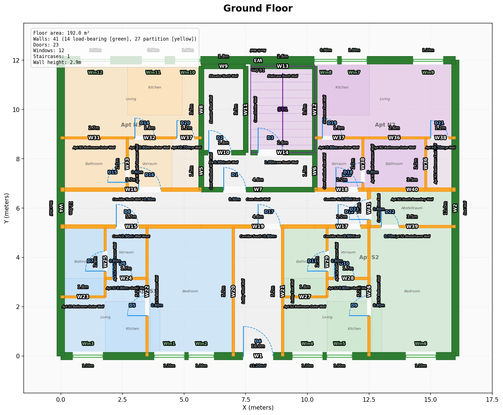
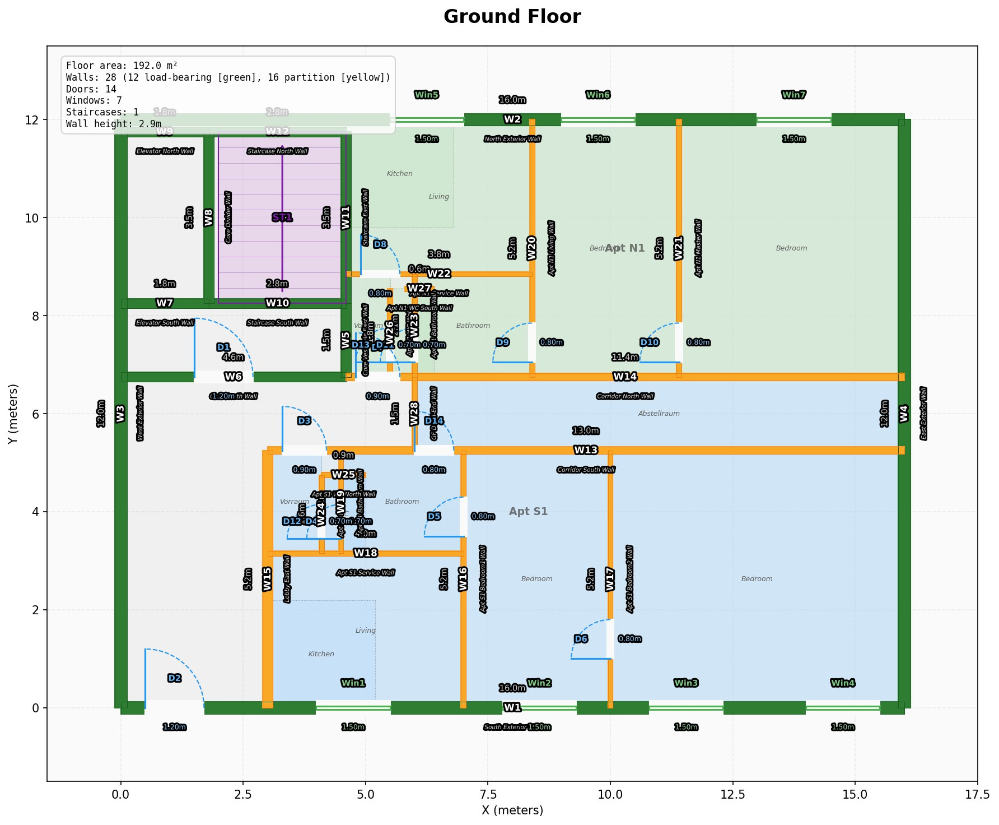

# 🏗️ AI Building Designer

AI-generated apartment buildings. Give it a footprint, get back a multi-storey building with apartments, staircase, elevator — exported as IFC for ArchiCAD.

Built in a weekend. By talking to a phone. With one functioning hand. [Here's the story.](docs/STORY.md)

---

## What This Does

```
"Create a 4-storey building, 16×12m, 4 apartments per floor,
 elevator + staircase"
         ↓
   AI generates building
         ↓
   Validators catch errors (398 of them)
         ↓
   AI reads failures, fixes them
         ↓
   Repeat until 0 errors
         ↓
   Export IFC → open in ArchiCAD
```

Think **pytest for buildings**. Structural checks, connectivity graphs, reachability analysis, Austrian building code compliance — all automated. The AI designs, the validators verify, the loop continues until it's right.

## Results

Two complete building variants, zero errors:

| Variant | Apartments | Walls | Doors | Windows | Sellable Ratio |
|---------|-----------|-------|-------|---------|---------------|
| 3-apt (corner core) | 5 total | 28/floor | 14-15 | 7 | 75.5% |
| 4-apt (centered core) | 8 total | 40-41/floor | 21-23 | 12 | 74.9% |

Each apartment has: Kitchen, Living, Bedroom, Bathroom, Vorraum (entrance hall), Abstellraum (storage).

**4-apartment variant, ground floor:**



**3-apartment variant, ground floor:**



## Architecture

```
src/archicad_builder/
├── models/        Pydantic data models (Building, Wall, Slab, Door, Window, Room, Apartment)
├── validators/    Structural, spatial, connectivity, building codes (Austrian OIB)
├── generators/    Apartment layout generators (shell → core → corridors → apartments)
├── queries/       Spatial queries, connectivity graphs, mermaid diagrams
├── export/        IFC export (ifcopenshell) + matplotlib floor plan rendering
├── vision/        Gemini vision integration (AI reads floor plan images)
└── cli/           Typer CLI — all operations through command line
```

### Validator System

Three severity levels, same as linting:

| Level | Meaning | Example |
|-------|---------|---------|
| **Error** | Must fix. Building is illegal/broken. | Wall intersects staircase. Apartment has no bathroom. |
| **Warning** | Should fix. Quality issue. | Room shaped like a tunnel (aspect ratio > 1.5). Sellable ratio below 65%. |
| **Optimization** | Could improve. Nice-to-have. | Dead-end corridor. Wet rooms not on same shaft. |

Validators include: structural integrity, wall connectivity, room reachability (BFS graph traversal), building code compliance (Austrian OIB standards), apartment completeness, space quality metrics.

## Quick Start

```bash
python -m venv .venv
source .venv/bin/activate
pip install -e ".[dev]"

# Run all 398 tests
pytest

# Validate a building
python -m archicad_builder validate projects/4apt-centered-core

# Render floor plan
python -m archicad_builder render projects/4apt-centered-core

# Export to IFC
python -m archicad_builder export projects/4apt-centered-core

# Building statistics
python -m archicad_builder stats projects/4apt-centered-core
```

## The Numbers

| | |
|---|---|
| Python source | 11,600 lines |
| Tests | 398 |
| Building designs | 2 complete variants |
| Time to build | 3 days |
| Tokens consumed | 207.5 million |
| Lines of code typed by hand | ~0 |

## How This Was Built

[📖 The full story — from an emergency room to AI-designed apartments in a weekend.](docs/STORY.md)

## What's Next

- Scoring function (single quality metric from all validators)
- Constraint solver (CSP) for macro-layout optimization
- MCTS / self-play for micro-layout (wall positions within apartments)
- Neural network training on 4090 GPU

## License

MIT
