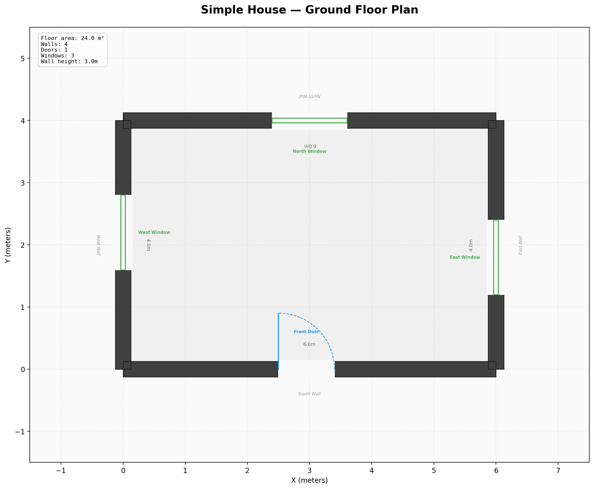
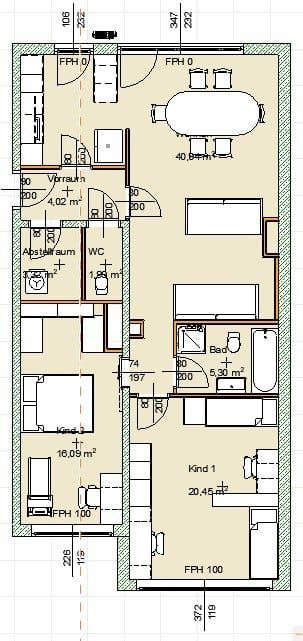
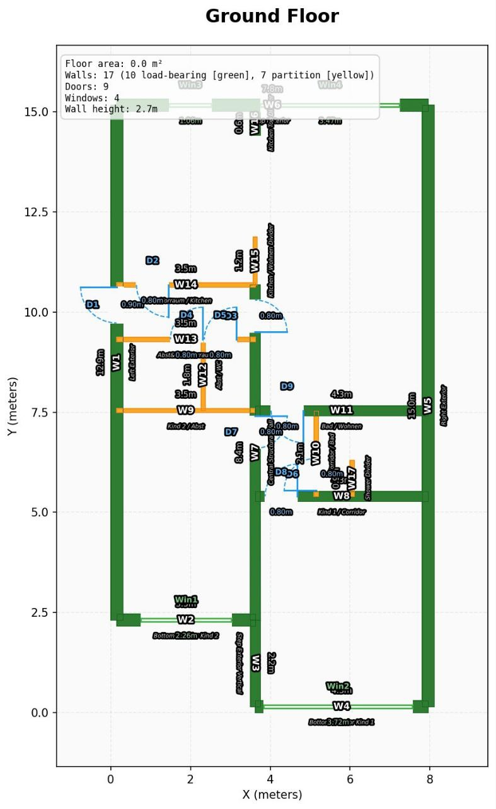
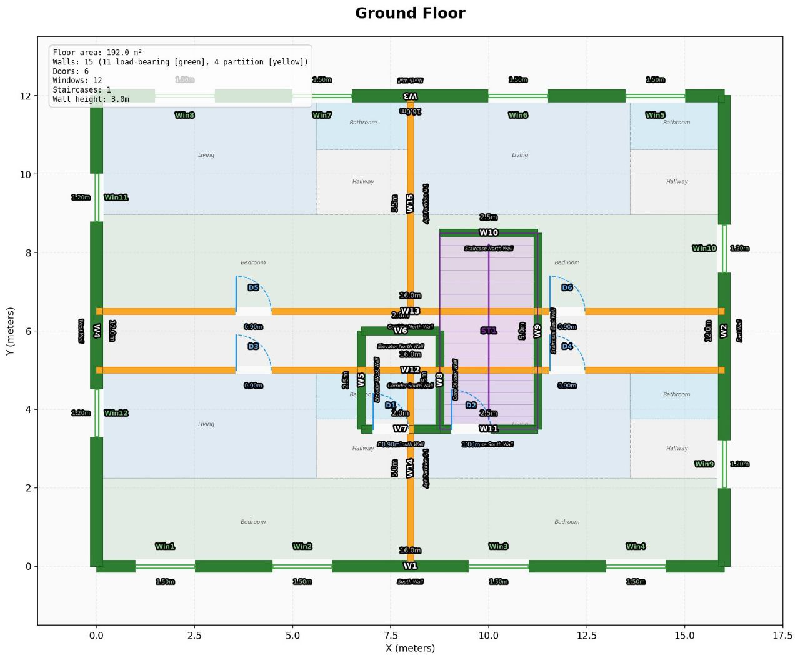
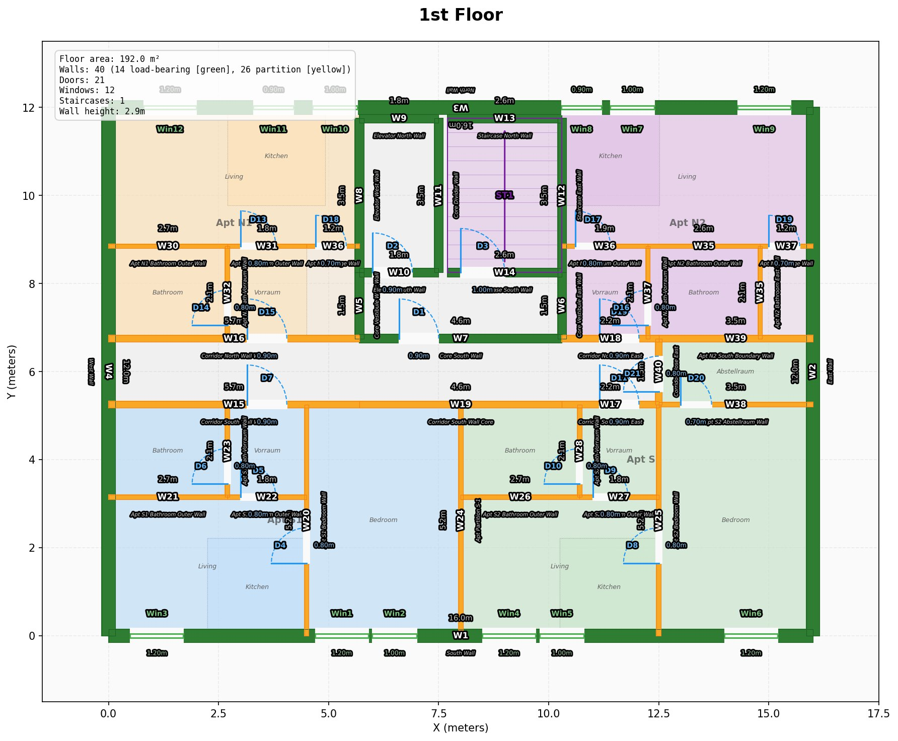

# How I Taught AI to Design Apartment Buildings in a Weekend

*Or: what a software engineer does when he can't type but can't stop thinking.*

---

Last Friday I cut my hand on a glass and ended up in the emergency room.

While waiting to get stitched up, my wife — an architect — was telling me about architectural competitions. How firms get invited to design buildings: here's the plot, here are the requirements, fit the apartments in. They spend *weeks* on a single proposal. Then someone reviews it and says yes or no.

Weeks of work. Hit or miss.

I was sitting there, one hand getting stitched up, the other holding my phone, and I started wondering: why can't AI do this? It's already writing production code, analyzing legal documents, passing medical exams. Spatial reasoning about apartments can't be *that* much harder.

I asked my wife: could AI design a building?

She said no.

From my experience, when people say "AI can't do X," it usually means AI is missing the scaffolding — not the intelligence. AI has gotten *dramatically* smarter in the past two years. But there's an intelligence overhang: we have more AI capability than we have tooling to use it. The intelligence is ahead of the infrastructure.

For coding, we solved this — compilers, type checkers, LSPs, test runners. That scaffolding is what turned "AI can sometimes write code" into "AI writes production systems."

Architecture has none of that. No compiler for buildings. No test runner for floor plans. No way for AI to check its own work.

So I decided to build the scaffolding. From the ER waiting room. One-handed.

I grabbed my phone and asked Claude a question:

> "I want to give an LLM tools to create and modify building models. Simple JSON schema — walls, doors, windows, slabs. CLI commands like add_wall, validate, export_ifc. What would that look like?"

After a few iterations, we converged on the architecture: IFC file format (the industry standard), ifcopenshell (Python library for IFC), and a JSON intermediate model. Simplest path, zero dependencies on running ArchiCAD.

From there I planned a three-step proof of concept:

1. **Friday:** Build the simplest possible house, export as IFC, open in ArchiCAD — prove the pipeline works end-to-end
2. **Saturday:** Give AI a real floor plan sketch, let it recreate the apartment using the tools
3. **Sunday:** Generate a complete multi-apartment building from scratch

All of this happened through Telegram voice messages on my phone. I wasn't sitting at a computer — I was having breakfast, watching movies with my daughter, taking breaks during dance class with my wife. The AI was building while I was living my weekend.

## Friday Night: Four Walls and a Prayer

Before anything fancy, I needed to know the pipeline worked. Four walls, a floor, a ceiling. Exported as IFC. My wife opened it on her laptop in ArchiCAD.

The most boring building in history, but it opened in professional architecture software. Pipeline validated.

"Don't start building something that won't work at the last mile" has saved me enough times in my career that I always do this first. 12.5 million tokens spent on four walls — but now I knew the whole chain worked.

## Saturday: My Wife's Sketch Meets AI

My wife had a floor plan of our apartment — a professional architectural drawing with room dimensions, wall thicknesses, door positions. I gave it to Gemini along with the tools: add_wall, add_door, add_window, move_wall.

<table>
<tr>
<td width="50%"> <em>Input: architect's floor plan sketch</em></td>
<td width="50%"> <em>Output: AI-generated apartment after 3 iterations</em></td>
</tr>
</table>

17 walls. 9 doors. 4 windows. Load-bearing walls classified separately from partitions. All placed by AI, reading a sketch, through iterative [design-and-review cycles](../../src/archicad_builder/vision/).

Not perfect. But the AI was *designing* — reading a drawing, placing elements, and checking its own work through visual comparison with Gemini. 25 million tokens. Still voice messages only.

## Saturday Night: The Vision

That evening, after getting back from dance class with my wife, I gave the AI its vision:

> *"Your goal: generate a complete 4-storey building, 16×12 meters. Elevator, staircase, multiple apartments per floor. We need validators — when they fail, you need to understand what failed, pull surrounding context, and fix it.*
>
> *It is important to create tools which work on the hardcore underlying JSON data. We can do validators in Python, execute them. Then you could understand the conflicts and issues, and then you could tweak them — pull up the surrounding context, what are the options to fix that issue, and then try to fix it.*
>
> *Think unit tests for buildings."*

This meant AI had to build entirely new capabilities — staircase elements, elevator shafts, corridor routing — none of which existed in the model before. It had to extend its own toolbox to handle the problem.

## The Massacre

Then I let the AI loose. It generated a multi-storey building for the first time.

Walls running through the staircase. Doors hitting elevator shafts. Rooms without boundaries. Apartments bleeding into each other.

My wife and I looked at the screen together and burst out laughing. It was, architecturally speaking, a crime scene.

But this is what code looks like before you have tests — and no intelligence to position things correctly when you can't verify the result. Obvious in hindsight.

## How Architects Actually Think

After we stopped laughing, my wife sat down and gave me something invaluable: the onboarding guidelines her firm gives to new architects. We recorded the whole conversation as a voice message and sent it straight to the AI through Telegram.

How to divide a building volume into floors (minimum 2.50m clear height, build at 2.52m for tolerance, ~37cm for concrete + flooring). How to split the facade into apartments (living room needs 3.60m of facade, master bedroom 2.80m, children's room 2.60m). Room requirements — master bedroom minimum 12m², children's minimum 10m². Every apartment needs a kitchen and bathroom. Two or more bedrooms? Separate WC is mandatory.

The same onboarding they give humans, we gave to the AI. Same rules, different student.

## Validators: Unit Tests for Buildings

When walls go through staircases, you don't need better prompts. You need tests.

I built Python validators that check the building model deterministically — the same way pytest checks code:

- **Structural**: Do walls intersect the staircase? Do doors fit in their walls? Do elements overlap?
- **Connectivity**: Can you walk from the entrance to every apartment? (BFS graph traversal)
- **Building codes**: Corridor ≥ 1.20m wide? Fire escape distance ≤ 35m? Ceiling height ≥ 2.50m? (Austrian OIB standards)
- **Spaces**: Does every apartment have a bathroom? A kitchen? Are rooms large enough?
- **Quality**: Room shaped like a tunnel? Sellable area ratio too low? Dead-end corridors?

Three severity levels — 32 error checks, 15 warnings, 3 optimizations:

| Level | Count | Meaning | Example |
|-------|-------|---------|---------|
| **Error** | 32 | Illegal/broken. Must fix. | Wall intersects staircase. Apartment has no bathroom. |
| **Warning** | 15 | Quality issue. Should fix. | Room shaped like a tunnel. Sellable ratio below 65%. |
| **Optimization** | 3 | Could improve. | Dead-end corridor. Wet rooms not on same shaft. |

Here's the thing I didn't expect: roughly 70% of these validators were written by the AI itself. It would look at a rendered floor plan, notice something wrong ("this room has no door," "these two walls overlap"), and write the validator to catch it. The other 30% I spotted and pointed out — things the AI didn't notice but that were obvious to a human eye.

The AI would generate a floor plan, run validators, read the errors ("Wall W3 extends 0.5m into the staircase area"), fix it, validate again. Loop until clean.

Same as TDD. But for buildings. 🏗️

*170 million tokens on Sunday alone. I was too excited to sleep.*

## Sunday Evening: Zero Errors

41 walls. 23 doors. 12 windows. Staircase and elevator. Four apartments per floor, each with kitchen, living room, bedroom, bathroom, entrance hall, and storage. Color-coded by apartment. 75% sellable area ratio — competitive with human designs.

Not hand-drawn. Not manually placed. AI-generated, AI-validated, AI-fixed.

## The Numbers

| | |
|---|---|
| Duration | 3 days (Friday evening → Sunday evening) |
| Git commits | 111 |
| Telegram voice messages | ~1,300 |
| Tokens (Friday) | 12.5 million |
| Tokens (Saturday) | 25 million |
| Tokens (Sunday) | 170 million |
| **Tokens (total)** | **207.5 million** |
| Validators | 50 (32 errors, 15 warnings, 3 optimizations) |
| Building variants | 2 (3-apartment + 4-apartment) |
| Apartments designed | 13 total |
| Code typed by hand | ~0 lines |
| Computer used | None — phone only (Telegram voice messages) |

That last line deserves emphasis: this entire project was built through voice messages on Telegram. I'd talk into my phone, it would get transcribed, the AI would write the code, run the tests, fix the issues, and send me the results and drawings. Not vibe coding — *Telegram speech message coding*. I wasn't even at my desk.

## The Insight

This is a weekend proof of concept, not a finished product. The buildings are simple. Real architecture is vastly more complex.

But the pattern is real. There's a scaffolding gap:

| | Coding | Architecture (now) |
|---|---|---|
| **Model** | Source code | JSON → IFC building model |
| **Tools** | Editor, LSP, refactoring | add_wall, move_wall, CLI |
| **Verification** | Compiler, pytest, linters | 50 validators (32 errors, 15 warnings, 3 optimizations) |

AI got dramatically smarter. But intelligence without scaffolding is like a brilliant architect with no pencil, no ruler, and no building code book. The capability is there — it just can't express itself.

It's tempting to put verification in prompts. "Hey AI, does this look right?" And it works... sometimes. Maybe 80% of the time. But when you're doing engineering, 80% isn't enough. Neither humans nor AI can keep every constraint in their heads simultaneously. That's literally why we invented automated testing.

We didn't *just* need smarter AI to design buildings. We needed to give it the right model, tools, and verification. The rest was conversation.

## What's Next

- **Real project**: Apply this to an actual building design my wife is working on
- **Growing the validator library**: Fire codes, structural stability, construction regulations, accessibility standards — every new rule just gets added to the library. The architecture stays the same, the rules keep growing. Architects can focus on *architecture* while the system handles compliance in real-time.
- **Interactive design**: Clients or architects interact through chat — "what if we move this wall 50cm?" — the system implements the change, runs all validators, shows the impact. Full conversational building design.
- **3D visualization**: The model is already IFC. Export to OBJ and render in a browser — not a technical challenge, just engineering.
- **Higher-level concepts**: My wife wants to encode architectural design patterns — the conceptual problems and solutions that experienced architects carry in their heads
- **Context tools**: We already export mermaid diagrams and visual context so the LLM can reason about building structure — expanding this further
- **Constraint solver**: Macro-layout optimization — which apartment where, stairwell position
- **Self-play**: The reasoning happens in the LLM (Claude, Gemini) — but with self-play on a 4090 GPU, the system could learn to design without being told how

---

*The code is in this repo. 398 tests. MIT license. Do with it what you will.*

*— Almir*
